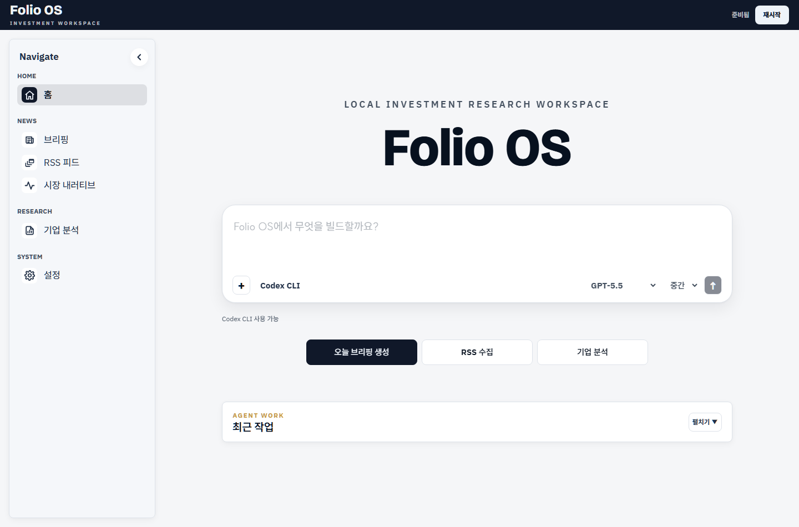
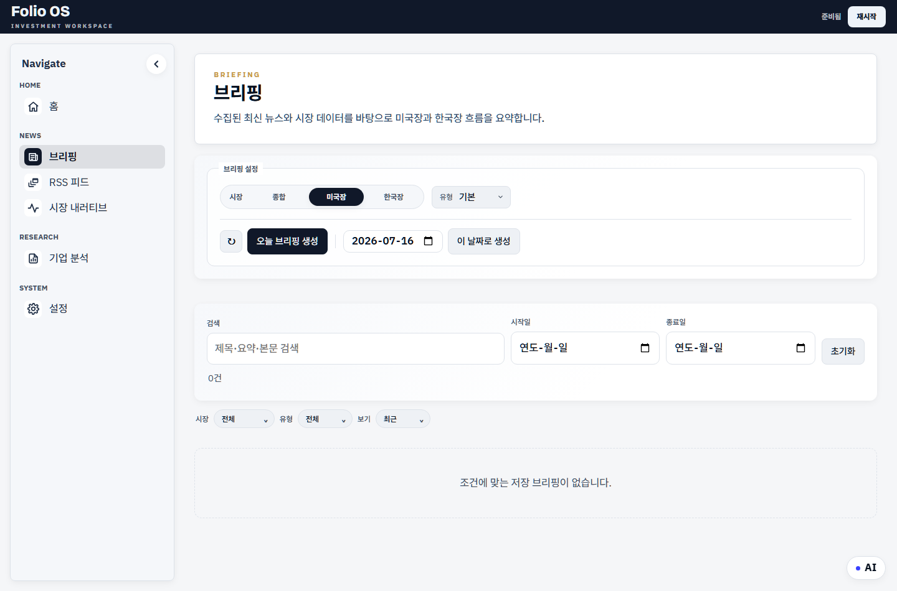
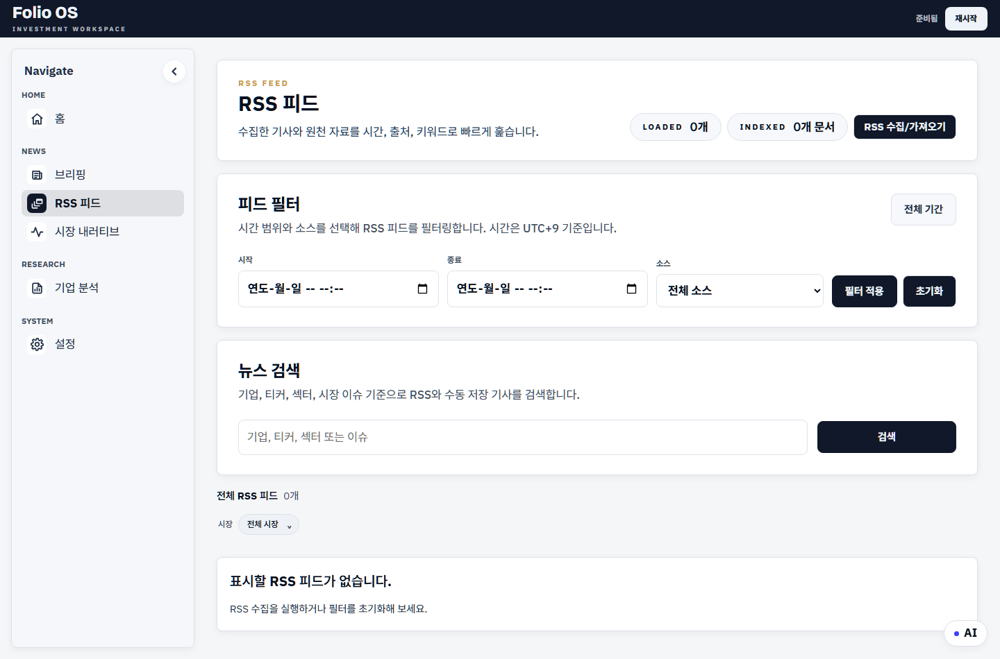

# Folio OS

**개인 투자자를 위한 로컬 우선 투자 리서치 워크스페이스**

[English README](README.md)

Folio OS는 내 PC에 저장한 시장 뉴스와 리서치 자료를 모아 일일 브리핑, 시장 맥락, 기업 분석으로 정리해 주는 로컬 투자 리서치 도구입니다.

자료와 생성된 보고서는 기본적으로 내 컴퓨터에 저장됩니다. LLM/API 연동은 선택 사항이며, 사용자가 설정한 경우에만 사용됩니다.

---

## 화면 미리보기

아래 이미지는 개인 리서치 자료, 보고서, 포트폴리오 데이터, API Key가 없는 깨끗한 샘플 워크스페이스에서 캡처했습니다.







---

## 0.1에서 할 수 있는 일

- Home 화면에서 Folio OS AI Agent와 대화하기
- 공개 RSS/뉴스 피드 수집 및 검색
- 미국/한국 시장 일일 브리핑 생성
- 중기 시장 상황을 요약한 Market Memory 확인
- 로컬 자료와 공식 데이터를 활용한 기업 분석 보고서 생성
- 보고서 옆 Folio Note 작성
- 생성된 보고서를 Obsidian 또는 Notion으로 내보내기
- LLM CLI/API, 모델 선택, RSS, 자동화, 내보내기 설정 관리

0.1 사용자 화면에서 제외하거나 뒤로 미룬 기능:

- Agent 작업 공간 형태의 Deep Research
- 대시보드 위젯과 워치리스트 워크플로
- 고급 포트폴리오 워크플로
- 고급 개인 노트 분석 워크플로
- 다크 모드와 설치 프로그램/트레이 앱 수준의 마감 작업

---

## 설치와 실행

자세한 설치 및 실행 방법은 [installation.md](installation.md)를 참고하세요.

권장 경로는 두 가지입니다.

- **AI Agent에게 맡기기**: GitHub 링크를 Codex, Claude Code 같은 로컬 코딩 Agent에게 주고 설치와 실행을 요청합니다.
- **직접 설치하기**: Python 의존성을 설치하고, `.env.example`을 `.env`로 복사한 뒤 시작 스크립트를 실행합니다.

설치 후 Windows 빠른 실행:

```text
start-archive.cmd
```

설치 후 macOS / Linux 빠른 실행:

```bash
bash start.sh
```

실행 후 브라우저에서 아래 주소를 엽니다.

```text
http://localhost:8787
```

Folio OS를 사용하는 동안 서버 실행 프로세스는 닫지 마세요.

---

## 자료를 넣는 위치

사용자가 직접 제공하는 리서치 자료는 `research-inbox/` 아래에 넣습니다.

```text
research-inbox/
  articles/   # 저장한 기사, 웹페이지, 텍스트/마크다운/html 파일
  rss/        # RSS 수집 결과
  reports/    # 증권사 리포트, IR 자료, 리서치 PDF
  filings/    # SEC/DART 공시와 공식 문서
  links/      # URL 목록
```

Folio OS가 생성한 데이터는 `data/` 아래에 저장됩니다.

```text
data/
  briefings/
  company-analysis/
  topic-reports/
  investment-notes/
  caches and local databases
```

`data/`, `research-inbox/`, `config/`, `.env`는 로컬 설정과 생성물이 들어갈 수 있으므로 의도 없이 삭제하지 마세요.

---

## 주요 화면

### Home

Home은 AI Agent의 기본 진입점입니다. 현재 워크스페이스 요약, 자주 쓰는 작업 시작, 리서치 맥락에 대한 질문 등에 사용할 수 있습니다.

### Briefing

일일 시장 브리핑을 생성하고 읽습니다. 브리핑은 뉴스/RSS 성격의 입력 자료와 가능한 경우 저장된 시장 스냅샷을 사용합니다. AI가 설정되어 있으면 더 풍부한 문장 생성에 활용하고, 사용할 수 없으면 규칙 기반 생성으로 대체됩니다.

### RSS Feed

공개 RSS/뉴스 항목을 수집, 필터링, 검색, 병합합니다. Folio OS는 유료 기사 접근을 우회하지 않습니다. 공개 RSS/링크 메타데이터와 사용자가 직접 저장한 자료만 사용합니다.

무료로 공개된 기사 본문은 로컬 보관용으로 함께 저장할 수 있습니다. Settings > 자동화 > RSS 수집의 `기사 전문 저장` 옵션(기본 켜짐)으로 켜고 끌 수 있으며, 저장된 본문은 브리핑과 검색 품질을 높이는 데 사용됩니다.

### Market Memory

중기 시장 상황을 하나의 현재 상태와 소수의 핵심 드라이버로 요약합니다. “지금 어떤 시장인지, 왜 그런지, 다음에 무엇을 봐야 하는지”를 빠르게 이해하는 데 초점을 둡니다.

### Company Analysis

공식 데이터와 로컬 리서치 자료를 활용해 기업 분석 보고서를 생성합니다. 미국 기업의 경우 SEC ticker/CIK 조회, companyfacts, 10-K/10-Q 성격의 근거 자료를 우선 사용합니다.

### Settings

AI Agent 모드, LLM CLI/API 설정, 저장된 모델 선택, RSS/자동화, Obsidian, Notion 설정을 관리합니다.

---

## 내보내기

### Obsidian

생성된 보고서를 로컬 Obsidian Vault로 내보낼 수 있습니다. Obsidian은 선택 사항이며, Folio OS를 사용하기 위해 필수는 아닙니다.

### Notion

설정 또는 `.env`에 `NOTION_TOKEN`, `NOTION_DB_ID`를 구성하면 생성된 보고서를 Notion 데이터베이스로 내보낼 수 있습니다.

---

## 프라이버시

Folio OS는 로컬 우선으로 동작합니다.

- 원천 자료는 `research-inbox/`에 저장됩니다.
- 생성된 보고서, 노트, 데이터베이스, 캐시는 `data/`에 저장됩니다.
- API Key는 `.env`에 저장됩니다.
- 클라우드 저장은 필수가 아닙니다.

AI/LLM 기능을 켜면 선택된 보고서 맥락이나 요약된 근거 자료가 설정한 Provider 또는 CLI 도구로 전송될 수 있습니다. 로컬 규칙 기반 동작만 원하면 AI 기능을 끄면 됩니다.

`.env`를 공유하거나 실제 API Key를 문서, 이슈, 채팅 로그에 붙여넣지 마세요.

---

## 개발자와 AI Agent를 위한 안내

프로젝트를 수정하기 전에는 [AGENTS.md](AGENTS.md), [CLAUDE.md](CLAUDE.md), 그리고 `features/` 아래의 관련 기능 README를 읽어주세요.

---

## 라이선스

Folio OS는 [BSD 3-Clause License](LICENSE)로 배포됩니다.

---

## 문제 해결

브라우저가 자동으로 열리지 않으면 아래 주소로 직접 접속하세요.

```text
http://localhost:8787
```

의존성이 누락되었으면 아래 명령을 실행하세요.

```powershell
py -3 -m pip install -r requirements.txt
```

또는:

```bash
python3 -m pip install -r requirements.txt
```

AI 기능이 동작하지 않으면 다음을 확인하세요.

- Settings에서 AI Agent가 활성화되어 있는지
- 선택한 LLM CLI가 설치 및 인증되어 있는지, 또는 API Key가 설정되어 있는지
- Provider 설정을 바꾼 뒤 모델 목록을 새로고침했는지

LLM 기능을 사용할 수 없어도 Folio OS는 로컬/규칙 기반 fallback으로 실행될 수 있어야 합니다.
